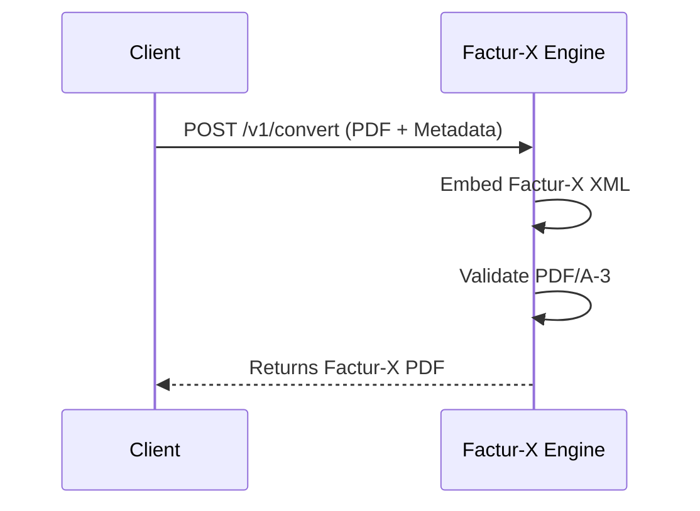
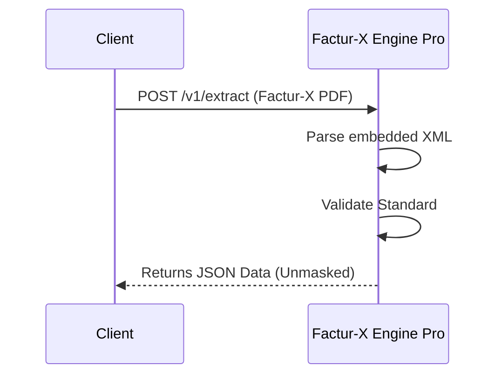

# Factur-X Engine (Community Edition)


**The simplest self-hosted Docker Middleware to generate compliant Factur-X (French E-Invoicing) and ZUGFeRD 2.2 PDFs.**
Turn standard PDFs into valid Hybrid Invoices (PDF/A-3 + XML) via a simple REST API.

---

## ⚡ Why Factur-X Engine?

As the 2026/2027 e-invoicing mandate approaches, developers need a reliable way to generate **EN 16931 compliant** invoices without rebuilding their entire billing stack.

* ✅ **Instant Compliance**: Generates valid **ZUGFeRD 2.2 / Factur-X 1.0** files.
* ✅ **Chorus Pro Standards**: Generates files following the EN 16931 standard requirements used by the French public portal.
* ✅ **Simple Integration**: It's a microservice. POST a PDF + JSON, get a Factur-X back.
* ✅ **100% Offline & Private**: Runs on your server. No data ever leaves your infrastructure, simplifying GDPR compliance.

## 📋 Technical Specs

* **Input**: Standard PDF (1.4+), any size.
* **Output**: PDF/A-3 compliant file with embedded `factur-x.xml`.
* **Profiles**: `MINIMUM`, `BASIC`, `BASIC WL`, `EN 16931` (Standard), `EXTENDED`.
* **Validation**: Returns a detailed JSON report (Format, Flavor, and list of errors).

## 🏗️ Architecture

### 1. Generation Flow

Turn any PDF into a Factur-X file in one API call.



### 2. Extraction Flow (Pro Feature)

Parse incoming invoices accurately.



## 🚀 Features

* **PDF to Factur-X**: Embeds the required XML metadata into your existing PDF layouts.
* **Validation API**: Check your existing invoices against strict schema rules (XSD + Schematron).
* **Data Extraction**: Parse incoming Factur-X invoices to JSON (Demo Mode in Community, Full in Pro).
* **Standards Support**: Supports profiles `MINIMUM`, `BASIC`, `BASIC WL`, and `EN 16931`.
* **Dev-Friendly**: Swagger UI documentation and JSON Validation reports.

## 📦 Quick Start

### Option 1: Docker (Recommended)

Run the container in 1 command:

```bash
docker run -p 8000:8000 facturxengine/facturx-engine:latest
```

👉 Open **[http://localhost:8000/docs](http://localhost:8000/docs)** to see the Swagger UI.

### Option 2: Run from Source (For Contributors)

1. Clone this repository.
2. Install dependencies:

    ```bash
    pip install -r requirements.txt
    ```

3. Run the server:

    ```bash
    uvicorn app.main:app --host 0.0.0.0 --port 8000
    ```

---

## 💻 API Usage

### 1. Generate an Invoice

Send your PDF and metadata to the API.
See `/docs` for full JSON schema properties.

```bash
curl -X 'POST' \
  'http://localhost:8000/v1/convert' \
  -F 'pdf=@invoice.pdf' \
  -F 'metadata={
    "invoice_number": "INV-2024-001",
    "issue_date": "20240117",
    "seller": {"name": "My Corp", "country_code": "FR", "vat_number": "FR123456789"},
    "buyer": {"name": "Client SAS"},
    "amounts": {"tax_basis_total": "100.00", "tax_total": "20.00", "grand_total": "120.00", "due_payable": "120.00"},
    "profile": "en16931"
  }' \
  --output factur-x_invoice.pdf
```

### 2. Validate an Invoice

Check if a file complies with the standard:

```bash
curl -X 'POST' \
  'http://localhost:8000/v1/validate' \
  -F 'file=@factur-x_invoice.pdf'
```

---

## 💰 Pricing & Features

| Feature | Community Edition 🆓 | Pro Edition 💎 | OEM / Source 🏢 |
| :--- | :---: | :---: | :---: |
| **Delivery** | Docker Hub (Public) | Docker Image (`.tar`) | Source Code Access |
| **Generation** | ✅ Unlimited | ✅ Unlimited | ✅ Unlimited |
| **Validation** | ✅ Unlimited | ✅ Unlimited | ✅ Unlimited |
| **Extraction** | ⚠️ **Demo Mode** | ✅ **Full Data Access** | ✅ **Full Data Access** |
| **License** | Open Source | **Business License** | **Commercial OEM** |
| **Privacy** | ✅ Self-Hosted | ✅ Self-Hosted | ✅ Self-Hosted |
| **Support** | Community Issues | Email Priority | Direct CTO Access |
| **Price** | **Free** | **€499 / year** | **[Contact Us](mailto:facturx.engine@protonmail.com)** |

👉 **[Get Factur-X Engine Pro](https://facturx-engine.lemonsqueezy.com)**

---

## ⚖️ Legal

* **Vendor**: Factur-X Engine (Paris, France)
* **License**: Community Edition is provided for testing and integration. Commercial use for extraction requires a Pro license.
* **Sales**: [facturx-engine.lemonsqueezy.com](https://facturx-engine.lemonsqueezy.com)
* **Contact**: [facturx.engine@protonmail.com](mailto:facturx.engine@protonmail.com)

*Built with ❤️ and Python 3.11 in Paris.*
